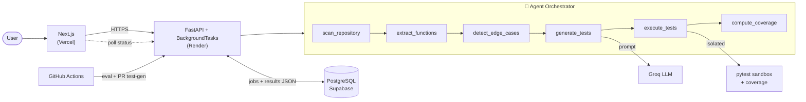

<div align="center">

<h1>🧪 TestCaseAI</h1>

### AI agent that generates, runs, and measures your Python tests

Paste a function, a GitHub repo, or a ZIP → get comprehensive **pytest** suites,
real **coverage**, and an observable **agent tool-trace** — deployed entirely on free tiers.

<br/>

[](https://automated-test-case-generator-agent.vercel.app/)
&nbsp;
[](https://automated-test-case-generator-agent.onrender.com/docs)
&nbsp;
[](https://github.com/Aaronrao989/Automated_Test_Case_Generator_Agent)

<br/>


</div>

---

## ✨ Overview

**TestCaseAI** is an agentic developer tool for the *"Teams lack sufficient tests, causing
regressions"* problem. Give it code and it acts as an **agent that invokes a sequence of
tools** — scan → extract functions → detect edge cases → generate tests → execute → measure
coverage — then shows you the whole trace, the generated tests, and real results.

> 🏆 Built by **Team Osaka Vise** for the **Capgemini Exceller AgentifAI Buildathon 2026** (Problem #38).

---

## 🎥 Screenshots

> _Add images to `docs/screenshots/` and they'll render here._

| Landing | Results & Coverage | Agent Trace |
|:---:|:---:|:---:|
|  |  |  |

---

## 🚀 Features

|  |  |
|---|---|
| 🧠 **Agentic & observable** | An orchestrating agent invokes 6 named tools and records a full **tool-call trace** (status + timing), shown live in the UI |
| 🤖 **AI test generation** | Groq-powered pytest — happy paths, boundaries, invalid inputs, and `pytest.raises` |
| 🔍 **Edge-case detection** | Null, boundary, type-mismatch, and exception analysis per function |
| ▶️ **Isolated execution** | Each job runs in its own temp dir; tests execute exactly once |
| 📊 **Real coverage** | Line coverage collected from the same run — not estimated |
| 📈 **Live progress** | Staged status with elapsed time, polled from the backend |
| 🗂️ **Rich results** | Tabs, syntax highlighting, copy, **download tests as ZIP**, coverage export |
| 🌓 **Dark / light mode** | Responsive, accessible, with skeletons and empty/error states |
| 🧪 **Eval harness + CI** | Golden-dataset scoring (relevance / pass-rate / coverage) enforced on every push |
| 🔒 **Hardened** | SSRF-guarded cloning, zip-slip protection, size-limited uploads, in-memory rate limiting |

---

## 🏗️ Architecture



Async work runs via FastAPI **`BackgroundTasks`** in-process — **no Docker, Redis, Celery, or
paid infrastructure**. Full write-up in [ARCHITECTURE.md](ARCHITECTURE.md).

---

## 🧰 Tech stack

| Layer | Tech |
|---|---|
| **Frontend** | Next.js 16 (App Router) · React 18 · TypeScript · Tailwind CSS · lucide-react |
| **Backend** | FastAPI · SQLAlchemy 2 · Pydantic v2 · Uvicorn |
| **LLM** | Groq (`openai/gpt-oss-120b` / `llama-3.1-8b-instant`) |
| **Database** | PostgreSQL (Supabase / Render) · SQLite for local dev |
| **CI/CD** | GitHub Actions · Vercel · Render |

---

## ⚡ Quick start

<details open>
<summary><b>Backend</b></summary>

```bash
cd backend
python3 -m venv venv && source venv/bin/activate
pip install -r requirements.txt
cp .env.example .env          # leave GROQ_API_KEY empty for offline "demo" mode
uvicorn app.main:app --reload # → http://localhost:8000  (docs at /docs)
```
</details>

<details>
<summary><b>Frontend</b></summary>

```bash
cd frontend
npm install
cp .env.example .env.local    # set NEXT_PUBLIC_API_URL=http://localhost:8000
npm run dev                   # → http://localhost:3000
```
</details>

<details>
<summary><b>Environment variables</b></summary>

**Backend** (`backend/.env`): `DATABASE_URL`, `GROQ_API_KEY`, `LLM_PROVIDER`, `GROQ_MODEL`,
`CORS_ORIGINS`, `ENVIRONMENT` · optional: `LLM_BATCH_SIZE`, `MAX_FILE_SIZE`, `MAX_FUNCTIONS_TO_ANALYZE`

**Frontend** (`frontend/.env.local`): `NEXT_PUBLIC_API_URL`
</details>

---

## 📡 API

| Method | Path | Purpose |
|---|---|---|
| `POST` | `/api/v1/analysis/start` | Analyze a snippet or GitHub URL |
| `POST` | `/api/v1/analysis/upload` | Analyze an uploaded ZIP |
| `GET` | `/api/v1/analysis` | List recent analyses |
| `GET` | `/api/v1/analysis/{job_id}` | Poll status / stage / results |
| `DELETE` | `/api/v1/analysis/{job_id}` | Delete a job |
| `GET` | `/health` | Health check |

Interactive docs: **[/docs](https://automated-test-case-generator-agent.onrender.com/docs)**

---

## 🧪 Tests & evaluation

```bash
cd backend && pytest tests/ -v          # unit + integration tests (24)
cd backend && python -m evals.run_eval  # score the generator on a golden dataset
cd frontend && npm run lint && npm run build
```

The **evaluation harness** (`backend/evals/`) scores the generator on **relevance, generation
rate, pass-rate, and coverage** against a golden dataset — and runs in CI on every push.
The **`pr-test-gen`** workflow generates tests for a PR's changed files and posts them as a
**PR comment** (add a `GROQ_API_KEY` repo secret for real output).

---

## 📁 Project structure

```
backend/
  app/
    main.py            FastAPI app · CORS · health · startup reconciliation
    core/              config · in-memory rate limiter
    db/                engine + session
    models/            AnalysisJob (single table, JSON results)
    api/               analysis routes
    services/          background analysis worker
    agents/            orchestrator · repo_scanner · edge_case_finder ·
                       llm_test_generator · agent_trace
    cli.py             CI/PR test-generation entrypoint
  evals/               golden dataset + scorer
  tests/               pytest suite
frontend/
  src/app/             landing · /analyze · /results/[jobId] · /dashboard
  src/components/       nav · footer · theme-toggle · ui/*
  src/lib/             api client · types · highlight · zip · utils
```

---

## 🗺️ Roadmap

- [ ] Containerized sandbox for arbitrary-dependency repos
- [ ] JavaScript / TypeScript test generation & execution
- [ ] Mutation testing & coverage heatmaps
- [ ] Multi-file dependency resolution
- [ ] Optional accounts + persistent per-user history

---

## 👥 Team — Osaka Vise

| Name | Role |
|---|---|
| **Aaron Rao** | AI Testing & Validation |
| **Aditi Karn** | System Architecture Lead |
| **Aryan Gupta** | UI/UX Developer |
| **Nitin Chugh** | Backend & API Engineer |
| **Vidushi Srivastava** | Presentation Lead |

---

<div align="center">

**MIT Licensed** · Built with ❤️ for the Capgemini Exceller AgentifAI Buildathon 2026

⭐ Star the repo if you found it useful!

</div>
